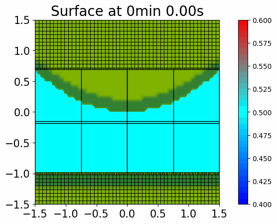

# Calm water bassin trapped in between dams

It seems that there is a error when a straight wall comes out of the water. A wave appears from the borders without any external action.

The following is the desired output (a still body of water):

But using `qinit.xyz` yields an inaccurate initial solution along the walls and causes waves:

