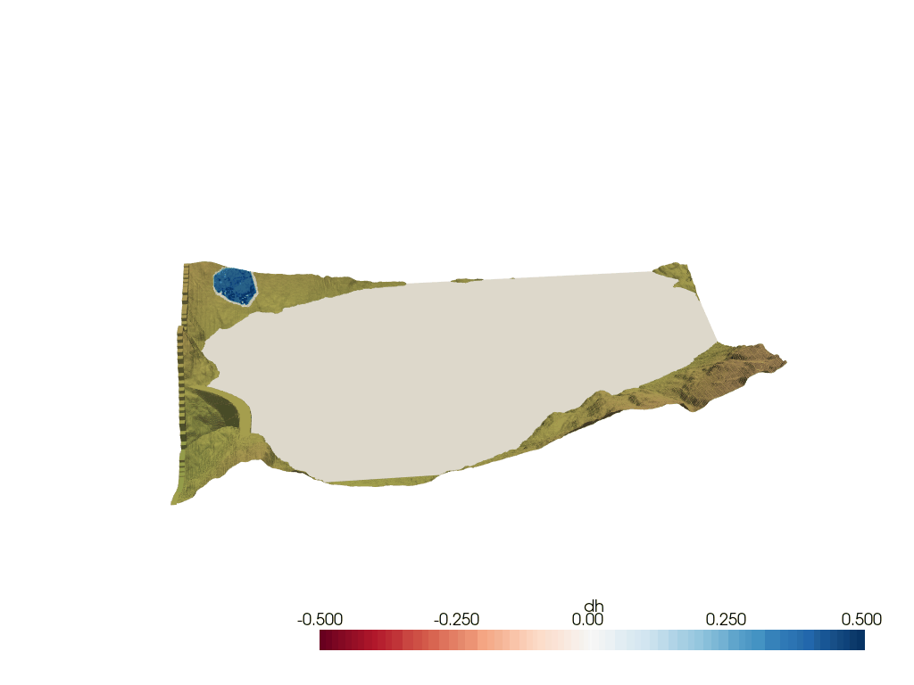

# Computing impulse waves with GeoClaw

This repository computes the impulse waves induced by snow avalanches. It was developped for the future [Trift reservoir](https://www.researchgate.net/publication/313646761_L'amenagement_hydroelectrique_de_Trift) (Gadmen, Bern, Switerland).

This work relies on Christophe Ancey's [@cancey](https://github.com/cancey)/[AVAC](https://github.com/cancey/avac.git) code's results files and depends on David George's [@dlgeorge](https://github.com/dlgeorge)/[Geoclaw](https://www.clawpack.org/geoclaw) module from Randall J. Leveque's [@rjleveque](https://github.com/rjleveque)/[Clawpack](https://www.clawpack.org/).

## Goal

Let's say you have the results of an AVAC simulation on a fixed grid output ([`fgout`](https://www.clawpack.org/fgout.html)).


Then the goal is to simulate the impulse wave generated by the snow avalanche entering a lake.



## Requirements

- [Clawpack](https://www.clawpack.org/installing_pip.html#install-quick-all)
- [liblapack-dev](https://www.netlib.org/lapack/) and [libopenblas-dev](http://www.openmathlib.org/OpenBLAS/)
- `python>=3.7` (in order to use [pathlib](https://docs.python.org/3/library/pathlib.html) and [PyYAML](https://pypi.org/project/PyYAML/)). The required packages to install are listed in [requirements.txt](requirements.txt):
  - [matplotlib](https://pypi.org/project/matplotlib/)
  - [PyYAML](https://pypi.org/project/PyYAML/) for reading the `config.yaml` file.
  - [scikit-image](https://pypi.org/project/scikit-image/) for treating the bathymetry.

## Preparing, running and reading the simulation

The notebook [`ImpulseWave.ipynb`](ImpulseWave.ipynb) covers everything needed to prepare the topography files, run the simulation and read the results. It is the recommended, quickest and most safest way to run this project while being flexibile.

## From the command line (for geeks)

The data in the AVAC output directory (specified in `config.yaml:AVAC_outdir`) is used to introduce an avalanche with adjusted fluxes according to the density ratio between snow and water.

To run the simulation, simply use `make`. The directory from which to read the AVAC results can be specified in `make data` as follows:

```Makefile
echo $PWD  # You this project's directory
make new  # Compile fortran codes, you only need to do this once
make qinit  # Create qinit.xyz (initial surface)
make data AVAC_outdir=../avac/_output  # Prepare the datafiles,
                                       # ../avac/_output is the default value
make output  # compute
```

### Adding a dam in the topography

You can include a dam in the topography by setting the path to the shapefile of a dam in `config.yaml:dams` and its level in `config.yaml:dam_alt` before running [`insert_dam.py`](insert_dam.py).

### Lake as initial solution: [`makeqinit_matplotlib.py`](makeqinit_matplotlib.py)

(or [`makeqinit_pyvista.py`](makeqinit_pyvista.py) if the file is not too large)

The `skimage.morphology.flood` function is used to fill the dam's bassin up to some altitude from a given seed point. To easen up the usage, an interactive matplotlib figure is used to click on some location which will be the seed and fill up to any altitude entered through text input. The lake level, the flood seed and the dilation radius can also be specified in `config.yaml:lake_alt` and `config.yaml:flood_dilation`.

The dilation is needed because of an interpolation error, causing waves at the edge of steep borders.

### Flux introduction

The mode of mass and momentum introduction can be chosen in `config.yaml:mode`. It can be either `bc` (the boundary conditions) or `src` (through the source term, acting like curvilinear boundary conditions). The `src` option is recommended for accuracy while `bc` consumes less memory.

#### From the boundary conditions (`bc`)

The saved files (from the AVAC fgout) are read by `setprob.f90` through the `helpers.f90` module. During the simulation, the `bc2amr.f90` subroutine then reads the appropriate section of the data to introduce the flow with a damping coefficient, interpolated in time then in space.

With this mode of flux introcution, the variable `q_avac` has 4 dimensions: `q_avac(time, side, i, variable)` where

- `time` is the index of the fgout frame from AVAC with time `t`,
- `side` is the index of the boundary condition (left, right, bottom, top),
- `i` is the index along a side, it goes from 1 to `config.yaml:bc_size`,
- `variable` is the index that specifies wich of `x`, `y`, `h`, `hu` or `hv` to get.

The initialization of this array is done in [`helpers.f90:init_bc()`](helpers.f90#L65).

#### From the source term (`src`)

Same as boundary condition but with `b4step2.f90` instead of `bc2amr.f90`. This enforces the results from AVAC with the damping coefficient on all cells whose level `z` is higher than `lake_level+overhang`. It is first interpolated in time, then in space. It is a curvilinear boundary condition if you will.

With this mode of flux introcution, the variable `q_avac` has 4 dimensions again: `q_avac(time, variable, x, y)` where

- `time` is the index of the fgout frame from AVAC with time `t`,
- `variable` is the index that specifies wich of `h`, `hu` or `hv` to get.
- `x` is the index along the x-position on the AVAC fgout grid,
- `y` is the index along the y-direction ont he AVAC fgout grid,

The initialization of this array is done in [`helpers.f90:init_src_fgout()`](helpers.f90#L216).

### Plotting a fixed grid output (fgout_grid) with pyvista

```bash
python pyvista_fgout_grid.py \
[--outdir -o outdir="_output"] \
[--color_var -c variable="dh" ] \ # variable is one of the fgmax variables ()
[--fgno -n fgno=1] \
[--cmaps -m mpl_colormap_bathy mpl_colormap_variable=("gist_earth", "RdBu")] \
[--clim -l mpl_colormap_variable_lower mpl_colormap_variable_upper=(-0.5, 0.5)] \
[--file_name -f output_gif_movie_file_name=fgout.gif] \
[--init_frame -i init_frame_index=0] \
[--animate -a]
```

> Shortcuts:
>
> `h`: Jump 10 frames back
>
> `j`: Jump 1 frame back
>
> `k`: Jump 1 frame
>
> `h`: Jump 10 frames
>
> `m`: Record a movie into `--file_name` (`fgout.gif` by default)
>
> `q`: Close the window

### Plotting a fixed grid output (fgmax_grid) with pyvista

```bash
python pyvista_fgmax_grid.py \
[--outdir -o outdir="_output"] \
[--color_var -c variable="dh" ] \ # variable can be h, u, v, hu, hv, B, s or dh, du, ...
[--fgno -g fgno=1] \
[--cmaps -m mpl_colormap_bathy mpl_colormap_variable=("gist_earth", "RdBu")] \
[--clim -l mpl_colormap_variable_lower mpl_colormap_variable_upper=(-0.5, 0.5)] \
[--grid_file_name -g grid_file_name="fgmax_grids.data"]
```