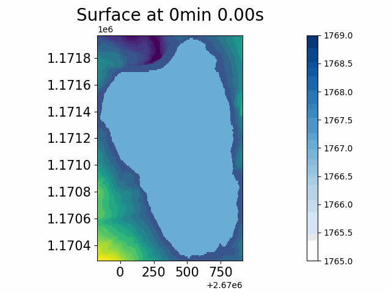

# TriftGeoclaw
This repository quantifies the impulse waves induced by snow avalanches in the future [Trift reservoir](https://www.researchgate.net/publication/313646761_L'amenagement_hydroelectrique_de_Trift) (Gadmen, Bern, Switerland).

This work is divided in two parts which are both based on David George's [Geoclaw](https://www.clawpack.org/geoclaw) module from Randall J. Leveque's [Clawpack](https://www.clawpack.org/).

# Requirements
- [Clawpack](https://www.clawpack.org/installing_pip.html#install-quick-all)
- [liblapack-dev](https://www.netlib.org/lapack/) and [libopenblas-dev](http://www.openmathlib.org/OpenBLAS/)
- `python>=3.7` (in order to use [pathlib](https://docs.python.org/3/library/pathlib.html)). The required packages are listed in [requirements.txt](requirements.txt):
    - [matplotlib](https://pypi.org/project/matplotlib/)
    - [PyYAML](https://pypi.org/project/PyYAML/) for reading the `config.yaml` file.
    - [scikit-image](https://pypi.org/project/scikit-image/) for treating the bathymetry.

# 1. Input data: bathymetry, avalanches and dam

## Bathymetry file (and dam): [topm/maketopo.py](topm/maketopo.py)
The bathymetry is essential to both the avalanche and the tsunami modelling. The [topm/maketopo.py](topm/maketopo.py) script modifies the original bathymetry specified in `config.yaml:TOPM:original_bathymetry` (in .asc or .tif format) and writes it to `config.yaml:TOPM:bathymetry`. You can use it if you need to:
- crop the data to `config.yaml:TOPM:bounds`,
- downscale (or upscale) the resolution to `config.yaml:TOPM:resolution`,
- and eventully add a dam from a geojson or a csv (with 2 columns: x and y) file specified in `config.yaml:TOPM:dam`.

> If your bathymetry file is already treated and does not need the edits above, just make sure that the `config.yaml:TOPM:bathymetry` points to that bathymetry file.

## Avalanches file: [topm/makeqinit_avac.py](topm/makeqinit_avac.py)

The avalanches file contains the coordinates of polygons that define the panels. It should either be a csv (with 3 columns: id, x and y) or a geojson so that it can directly be exported from a QGIS polygon shapefile. Once loaded, the snow cover will be determined according to the [VSG method](http://www.toraval.ch/articles/trad2.pdf). By passing an avalanche id as an argument to [makeqinit_avac.py](topm/makeqinit_avac.py), the avalanche with the corresponding avalanche id (avid for short) will be used to set the initial snow cover.

<!--
> ### Example of geojson file fron a polygons shapefile in QGIS
> ```json
> {
> "features": [
> { "properties": { "id": 1 }, "geometry": {
>     "type": "MultiPolygon", "coordinates": [ [ [
>         /// longitude, latitude
>         [ 2667324.50905901286751, 1170874.322037271922454 ],
>         [ 2667353.040285009425133, 1170896.59031122061424 ],
>         ...
>         [ 2667311.287271355744451, 1170840.919626349117607 ],
>         [ 2667324.50905901286751, 1170874.322037271922454 ] ] ] ] }
> },
> ...,
> { "properties": { "id": 4 }, "geometry": {
>     "type": "MultiPolygon", "coordinates": [ [ [
>         [ 2668405.216229078359902, 1170305.089284461690113 ],
>         [ 2668405.912112639285624, 1170238.284462615847588 ],
>         ...
>         [ 2668483.155187898315489, 1170355.888784406706691 ],
>         [ 2668405.216229078359902, 1170305.089284461690113 ] ] ] ] } }
> ]
> }
> ```
-->

# 2. Simulating the snow avalanches: [AVAC](https://github.com/giboul/TriftGeoclaw/blob/main/AVAC/README.md)

This part is forked from Christophe Ancey's (@cancey) work on dense avalanches, see his [AVAC](https://github.com/cancey/avac.git) repo.

The snow parameters (Voellmy, snow density, d0, ...) can be set in  `config.yaml:AVAC`.

Once the bathymetry file is ready, go into the `avac` directory, compile the fortran scripts with `make new` and create the data files with `make data`. The remaining file to prepare is `qinit.xyz`: create it with `make qinit` and specify which panel to initiate with `make qinit avid=<avalanche_id>` (default is `avid=1`). Finally, run `make output`.

To sum up:
```Makefile
echo $PWD  # You should be in the AVAC directory
make new  # Compile fortran codes, you only need to do this once
make data  # Prepare the datafiles
make qinit avid=1  # Create qinit.xyz (initial depth),
                   # specifying the avalanche id (optional)
                   # avid=-1 will assemble all avalanches
make output  # compute
```

# 3. Lake tsunami modelling: [TSUL](https://github.com/giboul/TriftGeoclaw/blob/main/TSUL/README.md)

Here, David George's [Geoclaw](https://www.clawpack.org/geoclaw) is used again. The data in the output directory is used to introduce an avalanche with ajusted fluxes according to the difference in density between the water and the snow.

To run the simulation, simply use `make` as well. The only difference is that the directory where the results will be read can be specified in `make data`:
```Makefile
echo $PWD  # You should be in the TSUL directory
make new  # Compile fortran codes, you only need to do this once
make qinit  # Create qinit.xyz (initial surface)
make data AVAC_DIR=avac/_output  # Prepare the datafiles, AVAC_DIR is optional
make output  # compute
```

## Lake as initial solution: `makeqinit_tsul.py`

The `skimage.morphology.flood` is used to fill the dam's bassin up to some altitude from a given seed point. To easen up the usage, an interactive matplotlib figure is used to click on some location which will be the seed and fill up to any altitude entered through text input ([topm/makeqinit_tsul.py](topm/makeqinit_tsul.py)). The lake level, the flood seed and the dilation radius can also be specified in `config.yaml:TSUL`:

The dilation is needed because of an interpolation error, causing waves at the edge of steep borders.
<!-- For an illustration, see the [DamErrorExample](https://github.com/giboul/TriftGeoClaw/blob/main/DamErrorExample/README.md).-->

# Flux introduction

The mode of mass and momentum introduction can be chosen in `config.yaml:TSUL:inflow`. It can be either `src` or `bc`.

### From the boundary conditions (`bc`)

The saved files from the AVAC results are read by the `setprob.f90` through the `helpers.f90` module. During the simulation, the `bc2amr.f90` subroutine then reads the appropriate section of the data to introduce the flow with a damping coefficient, interpolated in time then in space.

With this mode of flux introcution, the variable `q_avac` in TSUL has 4 dimensions: `q_avac(time, side, i, variable)` where
- `time` is the index of the fgout frame from AVAC with time `t`,
- `side` is the index of the boundary condition (left, right, bottom, top),
- `i` is the index along a side, it goes from 1 to `config.yaml:TSUL["bc_size"]`,
- `variable` is the index that specifies wich of `x`, `y`, `h`, `hu` or `hv` to get.

The initialization of this array is done in [tsul/helpers](tsul/helpers):`init_bc()`.
<!--  -->

### With the source term (`src`)

Same as boundary condition but with `b4step2.f90` instead of `bc2amr.f90`. This enforces the results from AVAC with the damping coefficient on all cells whose level `z` is higher than `lake_level+overhang`. It is first interpolated in time, then in space. It is a curvilinear boundary condition if you will.

With this mode of flux introcution, the variable `q_avac` in TSUL has 4 dimensions again: `q_avac(time, variable, x, y)` where
- `time` is the index of the fgout frame from AVAC with time `t`,
- `variable` is the index that specifies wich of `h`, `hu` or `hv` to get.
- `x` is the index along the x-position on the AVAC fgout grid,
- `y` is the index along the y-direction ont he AVAC fgout grid,

The initialization of this array is done in [tsul/helpers](tsul/helpers):`init_src_fgout_bin()`.
<!-- img src="tsul/movie_src.gif"/> -->

# Flowchart


# Shortcuts from the main directory: [Makefile](Makefile)
```Makefile
make new  # Compile both AVAC and TSUL programs
make topo  # Treat the topography
           # Creates topm/bathymetry.asc from
           # config.yaml:original_bathymetry.
           # Don't use it if your file is ready for use and
           # referenced by congif.yaml:bathymetry.
make qinit  # Create tsul/qinit.xyz
make output avid=1  # Make data files, avac/qinit.xyz and make output
```

# Plotting a FGout grid with pyvista:

> Only binary format at the moment

```bash
python pyvista_fgout_grid.py \
[outdir] \
[--color_by -c variable ] \ # variable is one of h, hu, hv, z, b, dh, ds
[--gridno -g grid_number] \
[--cmaps -m mpl_colormap_bathy mpl_colormap_variable] \
[--clim -l mpl_colormap_variable_lower mpl_colormap_variable_upper]
[--file_name -f output_gif_movie_file_name]
```


<!--
## Reading the dam overflows

For a given output, the fluxes at the dam can be read using `clawpack.visclaw.gridtools.grid_output_2d` again. See [tsul/flows.py](https://github.com/giboul/TriftGeoClaw/blob/main/TSUL/flows.py).


The profile of the wave can also be observed along le lake. Below is a profile of the lake from South to North when all avalanches are run.


-->
