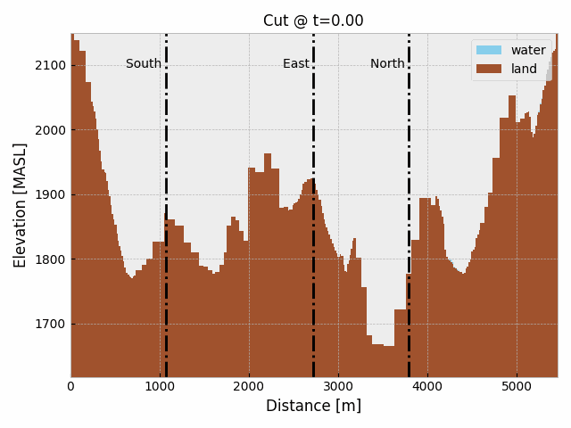
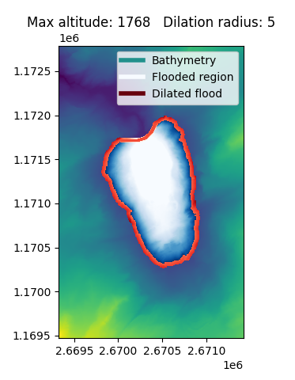
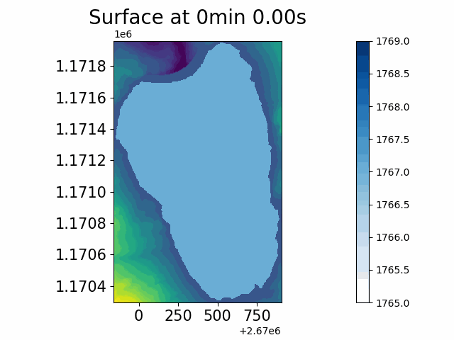
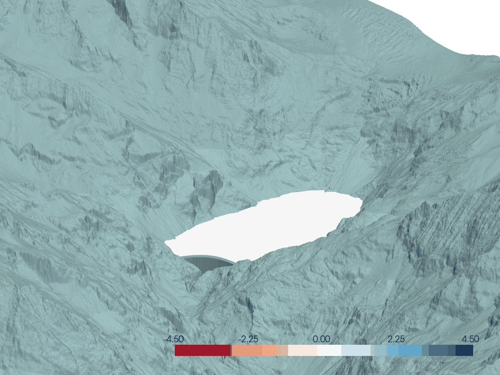

# TriftGeoclaw
This repository is an attempt to quantify the potential of impulse waves induced by snow avalanches in the future [Trift reservoir](https://www.researchgate.net/publication/313646761_L'amenagement_hydroelectrique_de_Trift) (Gadmen, Bern, Switerland).

This work is divided in two parts which are both based on David George's [Geoclaw](https://www.clawpack.org/geoclaw) module from Randall J. Leveque's [Clawpack](https://www.clawpack.org/). It may apply in other similar cases.

# 1. Simulating the snow avalanches: [AVAC](https://github.com/giboul/TriftGeoclaw/blob/main/AVAC/README.md)

This part is cloned from Christophe Ancey's (@cancey) work on avalanches, see his [AVAC](https://github.com/cancey/avac.git) repo. 

## `topo.asc`
A `tiff` file is expected. It will be cropped, downsampled and maybe rotated in the future to find the best bounding box of the lake. The expected final format is either `.xyz` or `.asc`. This can be done with tools like `gdal`, the `tifffile` package is used here because it comes with `scikit-image`. See [`topo.py`](https://github.com/giboul/TriftGeoclaw/blob/main/AVAC/topo.py).

## `qinit.xyz`
From an `geojson` of polygons, the avalanches are defined by `id` to be run together or separately. This treatment is done in [`qinit.py`](https://github.com/giboul/TriftGeoclaw/blob/main/AVAC/qinit.py).

```Makefile
make qinit avid=<avid>
```


## Running the avalanche

With a simple `make output`, the initial snow that was set will flow down.


<!--
## Measurement of the flows
The `clawpack.visclaw.gridtools.grid_output_2d` comes in handy here, it allows to extract all information passing though a curve. Thanks to this function, the momentum flux and the depth are quickly extracted and written to files in the `_cut_output` directory.


-->


# 2. Lake tsunami modelling: [TSUL](https://github.com/giboul/TriftGeoclaw/blob/main/TSUL/README.md)

Here, David George's [Geoclaw](https://www.clawpack.org/geoclaw) covers everything.

## `topo.asc`

The same process as the avalanche's `topo.asc` is applied, only with bounds capturing the lake limits.

## `qinit.xyz`

The `skimage.morphology.flood` is used to fill the dam's bassin up to some altitude from a given seed point. To easen up the usage, an interactive `matplotlib figure is used to click on some location which will be the seed and fill up to any altitude entered through text input:



The dilation is because of an (likely) interpolation error during simulation causing waves from the edge of steep borders. For an illustration, see the [DamErrorExample](https://github.com/giboul/TriftGeoClaw/blob/main/DamErrorExample/README.md).

```python
from skimage.morphology import flood

def fill_lake(topo, seed, max_level=0):
    mask = topo < max_level 
    initial_value = mask[*seed]
    mask[*seed] = True
    flooded = flood(mask, seed)
    flooded[*seed] = initial_value
    topo[flooded] = max_level
    return flooded

flooded = fill_lake(z, (seed_iy, seed_ix), lake_alt)
dilated = isotropic_dilation(flooded, radius)
```

## Introducing a flow

The mode of momentum introduction can be chosen in the `config.yaml` file (`tsul->inflow: 'src' or 'bc'`).

### From the boundary conditions

The saved files from the AVAC results are read by the `setprob.f90` through the `helpers.f90` module. During the simulation, the `bc2amr.f90` subroutine then reads the appropriate section of the data to introduce the flow with a damping coefficient.


### With the source term

SAme as boundary condition but with `src2.f90`.



## Fixed grid output

This convenient output format allows for easy visualization:



All results for Trift are in the `figures` folder.

<!--
## Reading the dam overflows

For a given output, the fluxes at the dam can be read using `clawpack.visclaw.gridtools.grid_output_2d` again. See [tsul/flows.py](https://github.com/giboul/TriftGeoClaw/blob/main/TSUL/flows.py).


The profile of the wave can also be observed along le lake. Below is a profile of the lake from South to North when all avalanches are run.


-->
