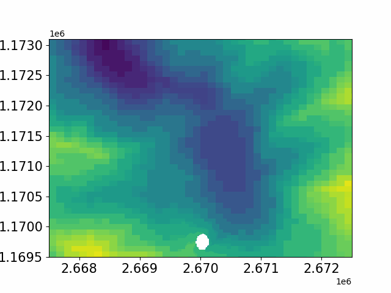
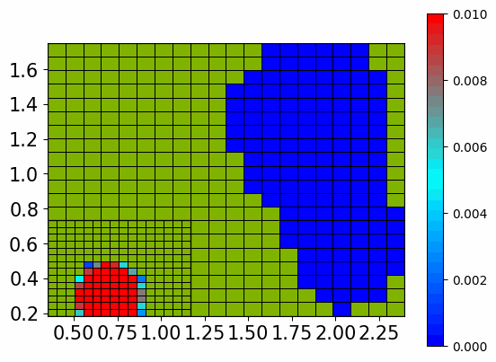
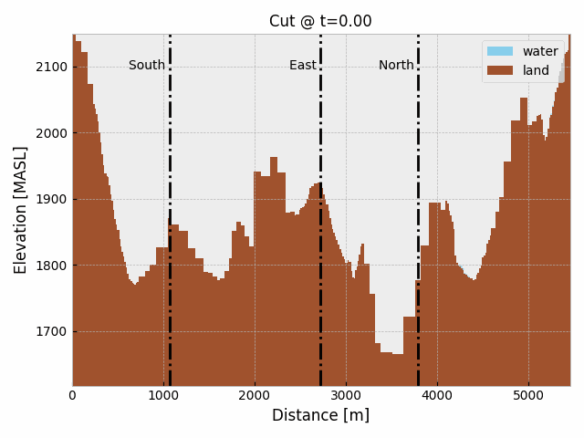

# TriftGeoclaw
This repository is an attempt to quantify the potential of impulse waves induced by snow avalanches in the future [Trift reservoir](https://www.researchgate.net/publication/313646761_L'amenagement_hydroelectrique_de_Trift) (Gadmen, Bern, Switerland).

This work is divided in two parts which are both base on David George's [Geoclaw](https://www.clawpack.org/geoclaw) module from Randall J. Leveque's [Clawpack](https://www.clawpack.org/).

# 1. Avalanches: [AVAC](https://github.com/giboul/TriftGeoclaw/blob/main/AVAC/README.md)

This part is copied from Christophe Ancey's (cancey) work on avalanches, see his [AVAC](https://github.com/cancey/avac.git) repo.

## `topo.asc`
A `tiff` file is expected. It will be cropped, downsampled and maybe rotated in the future to find the best bounding box of the lake. The expected final format is either `.xyz` or `.asc`. This can be done with tools like `gdal`, the `tifffile` package is used here because it comes with `scikit-image`. See [`topo.py`](https://github.com/giboul/TriftGeoclaw/blob/main/AVAC/topo.py).

## `qinit.xyz`
From an `geojson` of polygons, the avalanches are defined by `id` to be run together or separately. This tratment is done in [`qinit.py`](https://github.com/giboul/TriftGeoclaw/blob/main/AVAC/qinit.py).

## Running the avalanche
Each avalanche can be run individually with the command `make run avid=<avalanche id>` and the output will go to a folder named `_output<avid>`. `make output` or `make run` without specifying `avid` will run all avalanches.

## Measurement of the flows
The `clawpack.visclaw.gridtools.grid_output_2d` comes in handy here, it allows to extract all information passing though a curve. Thanks to this function, the momentum flux and the depth are quickly extracted and written to files in the `_cut_output` directory.

# 2. Wave modelling: [Tsunami](https://github.com/giboul/TriftGeoclaw/blob/main/Tsunami/README.md)

Here, David George's [Geoclaw](https://www.clawpack.org/geoclaw) covers everything.

# State of the repo
This work is in progress... The next steps are detailed in the [TODO.md](https://github.com/giboul/TriftGeoClaw/blob/main/TODO.md) file.

