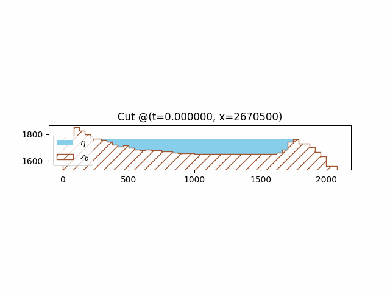
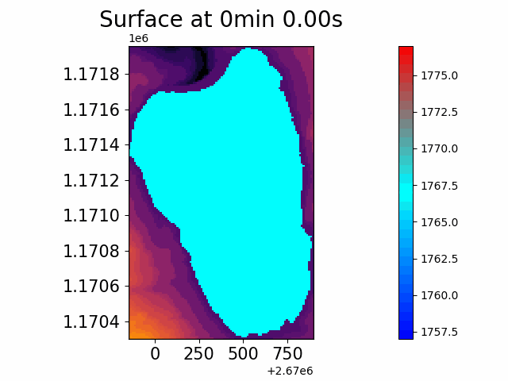

# TODO
- [x] Créer un Iplotclaw plus facile à utiliser: [arrowkeyplot.py](https://github.com/giboul/visclaw/blob/Iplot_mpl/src/python/visclaw/arrowkeyplot.py)
- [x] Écrire le fichier `qinit.xyz` par un algorithme de remplissage: fonction [`flood_mask`](https://github.com/giboul/TriftGeoClaw/blob/main/Tsunami/makeqinit.py#L26) dans `makeqinit.py`.
- [ ] Enregistrer les flux de neige entrants.
- [ ] Interpoler les flux entrants et les amortir par $\rho_\text{neige}/\rho_\text{eau}$ pour créer la bonne vague d'impulsion.
- [ ] Ajouter des graphes de l’intumescence au barrage (~~ligne de jauges~~ script python).
- [ ] Simuler toutes les avalanches proposées.
- [ ] Comparer les résultats à ceux des expériences VAW+LHE (test des conditions de bord).
- [ ] Faire un diagramme expliquant le fonctionnement de GeoClaw.

# Avancement du projet
Je mettrai ici à jour mon avancement à chaque étape.

## Vague introduite par une vitesse initiale
Il reste à introduire l'information par les conditions de bord et à mesurer l'état au niveau du barrage.




## Première avalanche
Il faut encore mesurer hauteur et vitesse à l'entrée de l'avalanche.
De plus, il en reste beaucoup d'autres à faire.


# Problèmes
- GitHub/AVAC: `qinit_module.f90` est bien corrigé mais il n'est pas listé dan le Makefile. Il faudrait écrire:
```Makefile
MODULES = \
  ./module_voellmy.f90 \
  ./qinit_module.f90 \
```
- AVAC/GRASS: L'archive `toraval.fr/r.avac.tar.gz` n'existe plus, tout est dans le git mais le manuel renvoie vers le site de toraval.

# À explorer 
- code cayle mandeli : two layer shallow water (water and avalanche?) `rpn2_layered` (clawpack/dev)
- Créer des fichiers setrun et setplot en [yaml](https://python.land/data-processing/python-yaml)?

