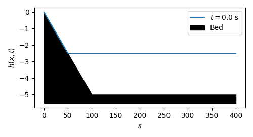

# TODO
- [x] Traiter les données de Gruner pour en tirer une topographie utilisable et assez légère pour des calculs rapides.
- [x] Installer Clawpack correctement (5.11.0).
- [ ] Déterminer une nivométrie selon Burkard-Salm (-3cm V/100m V).
- [x] Simuler une première avalanche avec AVAC.
- [x] Simuler une vague par solution initial et/ou conditions de bord.
- [x] Automatiser le transfert de quantité de mouvemeent.i
- [ ] Utiliser les codes BoussClaw en plus de Geoclaw
- [ ] Ajouter des graphes de l’intumescence au barrage (ligne de jauges).
- [ ] Inclure le barrage dans la topographie.
- [ ] Benchmark selon les expériences VAW+LHE (test des conditions de bord)?

# Questions
- Des sources à conseiller pour le manteau neigeux?
- Comment sont définis les panneaux de départ? Par analyse experte sur le terrain?
- Introduction de la quantité de mouvement: remplacer la neige par de l'eau (h/3) et de même quantité énergie?
- David L. George, D-CLAW => simplement mettre un coefficient de transfert de quantité de mouvement?

# Problèmes
- GitHub/AVAC: `qinit_module.f90` est bien corrigé mais il n'est pas listé dan le Makefile. Il faudrait écrire:
```Makefile
MODULES = \
  ./module_voellmy.f90 \
  ./qinit_module.f90 \
```
- AVAC/GRASS: L'archive `toraval.fr/r.avac.tar.gz` n'existe plus, tout est dans le git mais le manuel renvoie vers le site de toraval.

# Avancement du projet
Je mettrai ici à jour mon avancement à chaque étape.

Pour rappel pour les deux figures suivantes, la topographie ressemble à ceci:


## Vague introduite par une vitesse initiale
Il reste à introduire l'information par les conditions de bord et à mesurer l'état au niveau du barrage.


## Première avalanche
Il faut encore mesurer hauteur et vitesse à l'entrée de l'avalanche.
De plus, il en reste beaucoup d'autres à faire.


## Vague d'impulsion



# À explorer 
- code cayle mandeli : two layer shallow water (water and avalanche?) `rpn2_layered` (clawpack/dev)
- Créer des fichiers setrun et setplot en [yaml](https://python.land/data-processing/python-yaml)?

